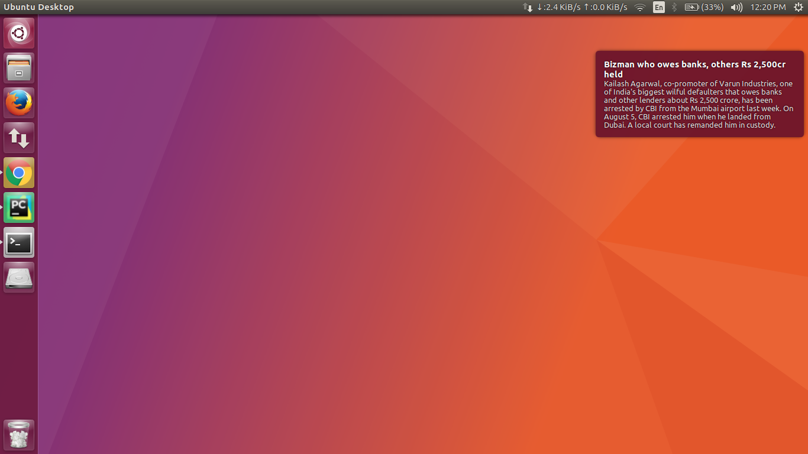
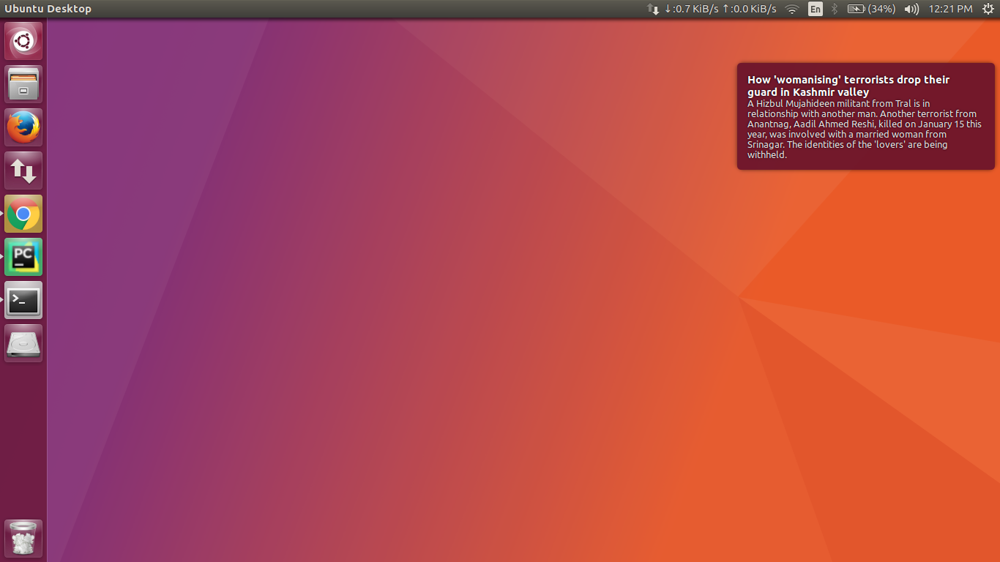

# UbuntuNewsFeed
Clone the repo to your computer and run the notify.py file.
#Dependencies
notify2,requests
These can be easily installed using the following commands
pip install notify2
pip install requests

#Screenshots

